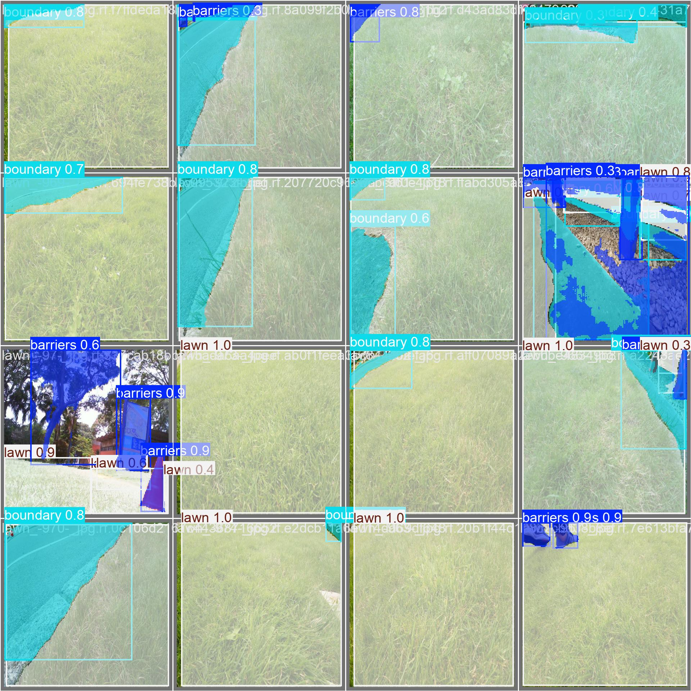

# Autonomous Lawn Mower 🌱

A boundary-free autonomous lawn mower built for my Mechatronics capstone (MSE 4499) —
**perception + SLAM + coverage planning + layered safety**, running on **ROS 1 Noetic**,
validated in **Gazebo/RViz**, targeting a **Jetson Nano** + **Arduino Mega**. Earned an
Honourable Mention at Western Engineering Design Day.

This repo has two parts:
- **`src/mower_perception/`** — the AI-perception module (my core contribution): YOLOv8
  obstacle detection + lawn segmentation, packaged as a standalone, tested Python package
  with an interactive Gradio demo.
- **`mower_ws/`** — the full ROS 1 workspace: SLAM, sensor fusion, coverage planning,
  motor control, and the safety-filter stack, run in Gazebo/RViz.

See [`docs/ARCHITECTURE.md`](docs/ARCHITECTURE.md) for how it all fits together.

## What it does
- **Detection** — locates safety-relevant obstacles (people, pets, objects) in the mower's
  camera view so the system can avoid them.
- **Segmentation** — classifies *cuttable lawn* vs *boundaries / non-grass*, used for
  "no-cut" reasoning so the blade only runs on valid grass.

## Results
| Task | Model | Metric | Score |
|------|-------|--------|-------|
| Obstacle detection | YOLOv8 | box mAP@0.5 | **0.764** |
| Lawn segmentation | YOLOv8-seg | mask mAP@0.5 | **0.745** |

*Trained on a custom, hand-labeled lawn dataset; tuned architecture and hyperparameters.*



## Demo
An interactive **Gradio** app — upload an image and see detections and lawn segmentation
overlaid with confidence scores.

<!-- Add a screenshot/GIF here after your first run:  -->

```bash
python app.py
```

Try it with the sample yard photos in `examples/inputs/`, or upload your own.

## Simulation demo

The full capstone (perception + SLAM + planning + safety) was validated end-to-end
in Gazebo/RViz.

> 🎥 [Simulation walkthrough video](https://drive.google.com/file/d/1WV4yyKTy9lSwmz7GJ16YfoIyf3QvnkAL/view?usp=share_link)

## Installation
```bash
git clone https://github.com/malakalhanafi02/Autonomous-Lawnmower.git
cd Autonomous-Lawnmower
pip install -r requirements.txt
```

## Usage (as a library)
```python
from mower_perception.detector import Detector

det = Detector("models/detection_best.pt", conf=0.4)
results = det.predict("examples/yard.jpg")   # returns structured detections
```

## How it works
YOLOv8 ("You Only Look Once") is a single-pass CNN that predicts all boxes/masks in one
forward pass, making it fast enough for real-time use on edge hardware (the capstone ran it
on a Jetson Nano). Detections are used **conservatively** — treated as cautious
"avoid / no-cut" hints rather than exact boundaries — because in a safety-critical system
it's better to be slightly over-cautious than to trust an imperfect mask.

## Project structure
```
src/mower_perception/   # detector.py, visualize.py, config.py (perception package)
tests/                  # pytest unit tests
app.py                  # Gradio demo
models/                 # trained weights (detection_best.pt, segmentation_best.pt)
examples/               # sample images + result figures
training/               # training notebooks (Colab, reference)
mower_ws/               # ROS 1 (Noetic) workspace — SLAM, planning, safety, motor control
docs/ARCHITECTURE.md    # how it all fits together
```

## Context & credits
AI-perception component of a 5-person MSE 4499 Mechatronics capstone, which earned an
Honourable Mention at Western Engineering Design Day. Detection and segmentation models
trained and tuned by me.
